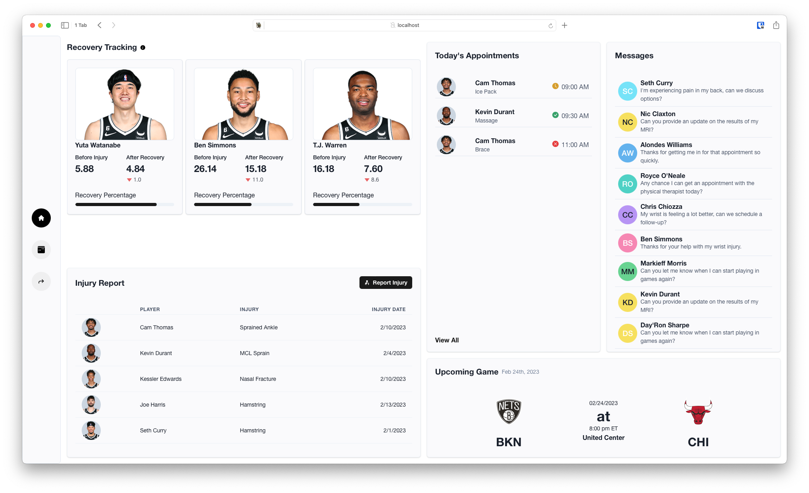

# Injury Management

This website is an injury and rehabilitation management platform designed for NBA teams. It provides comprehensive management of player injuries, physical therapy exercises and recovery progress.

# Features

### Injury Reporting

- Keep track of your team's injuries and report new injuries as they occur
- Tracks the treatments done to previous injuries, so you can access that information when a player gets injured again

### Exercise Tracking

- Monitor a player's recovery progress by logging their performance on specific exercises

### Player Appointment Management

- Centralized location for all player appointments
- Interactive timeline and calendar to view all appointments at a glance
- Schedule appointments to perform treatments to injuries
- Update appointments information along with adding notes

### Recovery Tracking

- Track the performance of newly recovered players
- Determine player's progress towards returning to level of play prior to injury

How it's calculated

First, I get the Fantasy Points 5-game average prior to the player's injury. Then I get the average of the games after they have recovered. This allows me to measure the differences in their performance before and after the injury.

> I wanted to use either Player Efficiency Rating or another advanced statistic that incoporates various other stats. However, due to the limitations of the NBA API, I did not have access to those particular statistics, so I resorted to using NBA Fantasy Points instead.

 

### Auto Complete Text Fields

When reporting a new injury, the player name field auto completes for all players on the team

When reporting a new injury, the injury field auto completes for all injuries that have been recorded. If an injury isn't in the available options, it will be added after the form is submitted.

When scheduling a new appointment, the treatment field auto completes for all treatments that have been done on the specific injury. If a treatment isn't in the available options, it will be added under that injury after the form is submitted.

# Notes

Some parts of the website are just included to show ideas that I had that were out of the scope of the project. These include:

- "Messages" card on the dashboard. The idea was that there would be a second player-facing website that would allow players to message the team doctors and confirm appointments. That is also why on the "Today's Appointments" card, there is a status on the left of the appointment time.
- Pain level on the exercise tracking page. This would be would be easy to implement but I didn't in the interest of time.
- "Recovery tracking" does have data behind it but the NBA API blacklists IPs from hosting providers so I wasn't able to get the most up to date data. The data is up to 02/16/2023.

On the "All Appointments" page, there is a bug that requires you to click the date on the calendar twice to get the appointments for that day. I was unable to figure out why this was happening.
